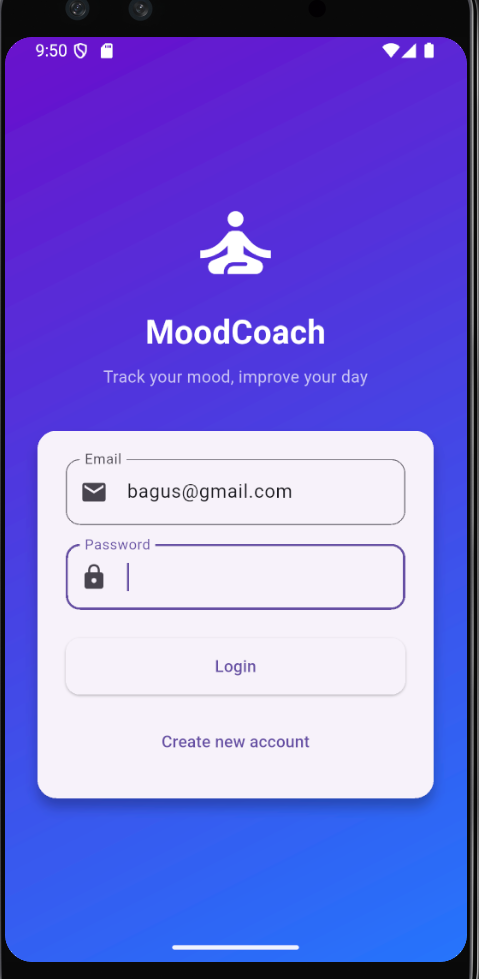
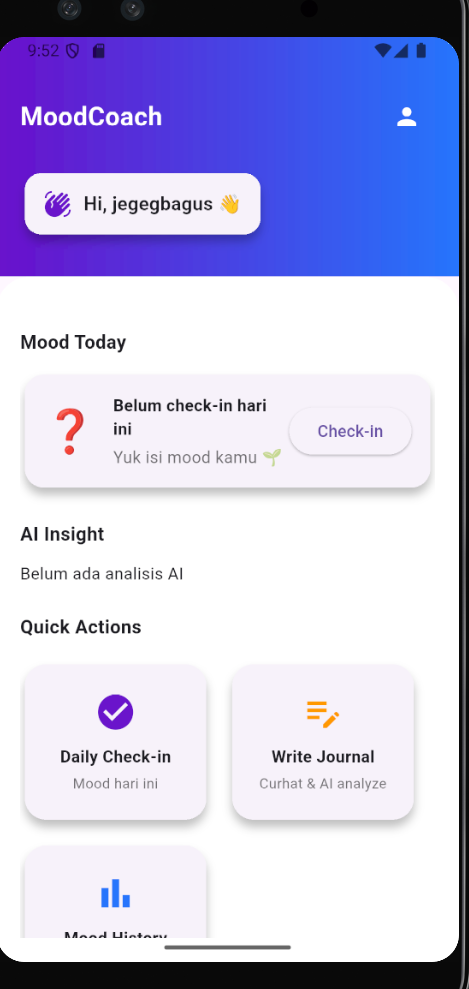
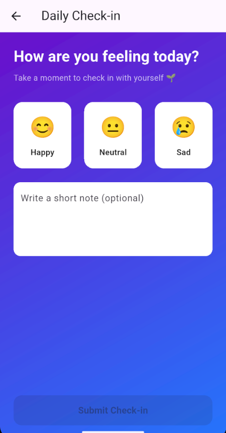
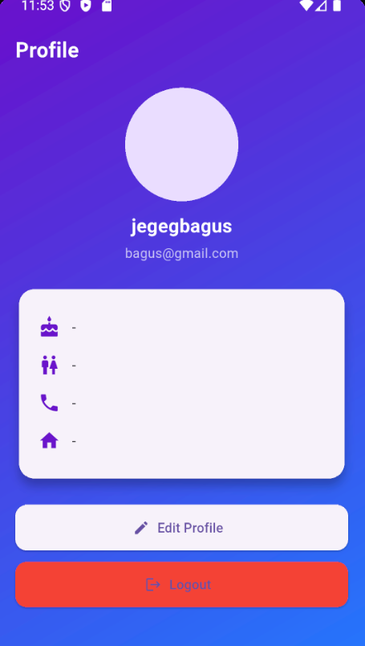
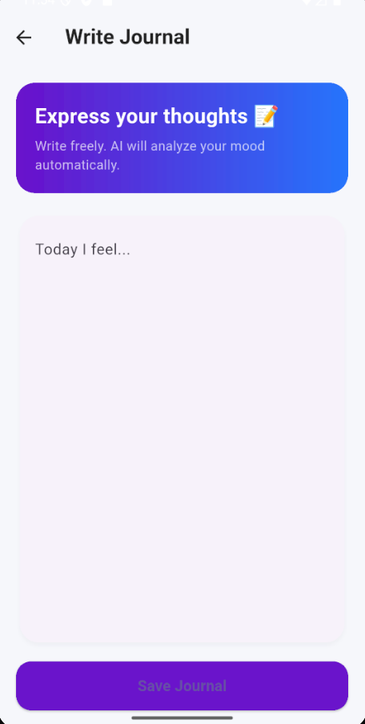

🧠 MoodCoach Mobile App

MoodCoach is a Flutter-based mobile application designed to help users monitor their daily mood, reflect through journaling, and receive personalized activity recommendations to improve mental well-being. The app leverages AI BiLSTM + Attention to provide accurate mood assessments and actionable suggestions.

📌 Key Features

📝 Mood Tracking & Journal: Quickly record your daily mood and write personal reflections in a mood journal.

🤖 AI Mood Prediction: Advanced BiLSTM + Attention model predicts and analyzes your mood for higher accuracy.

💡 Activity Recommendations: After submitting mood/journal, the app suggests personalized activities to enhance well-being.

🏃 Activity Tracker: Users can log daily activities they perform to monitor lifestyle habits.

🎨 User-Friendly UI: Intuitive and clean interface for seamless navigation.

## Screenshots

### Login

  

 

### Home Page

  

 

### Dailychekin

  

 

### Profile

  

 

### Write jurnal

  

 

